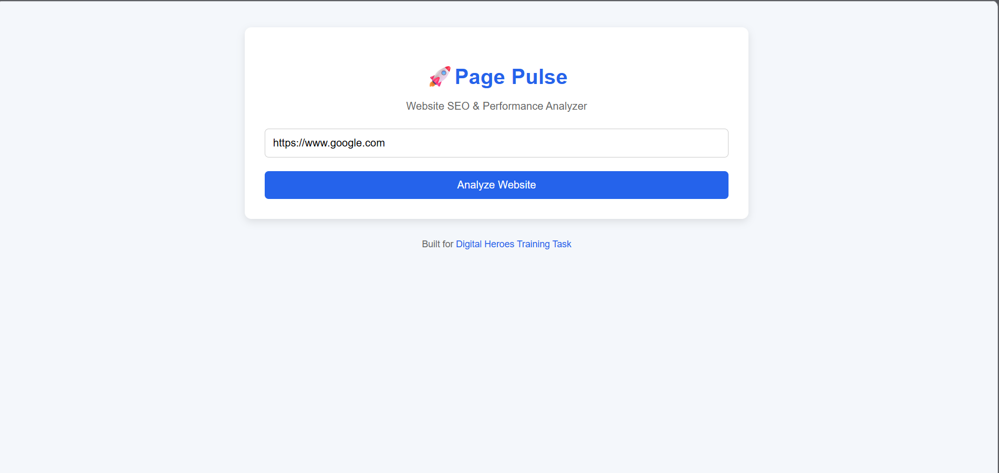
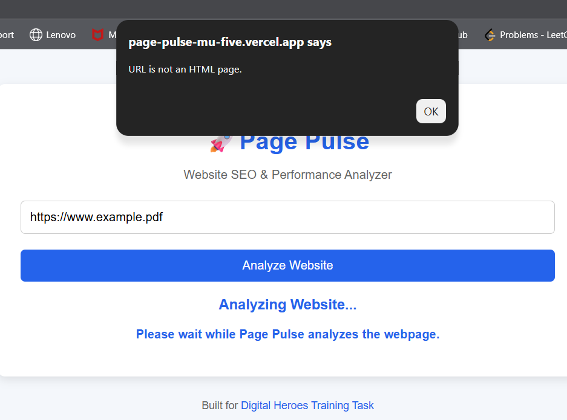

# 🌐 Page Pulse

**Page Pulse** is a simple web-based SEO and webpage analysis tool built using **Flask**, **HTML**, **CSS**, and **JavaScript**. It analyzes a website and provides useful insights such as page title, meta description, heading count, word count, image accessibility, response time, and HTTP status code.

This project was developed as part of a **Software Development Internship Assignment**.

---

## 🚀 Live Demo

### Frontend (Vercel)
https://page-pulse-mu-five.vercel.app/

### Backend API (Render)
https://page-pulse-lmls.onrender.com/

---

## ✨ Features

- ✅ Analyze any valid website URL
- ✅ Extract webpage title
- ✅ Extract meta description
- ✅ Count H1 headings
- ✅ Count total visible words
- ✅ Detect images missing Alt attributes
- ✅ Display HTTP response status code
- ✅ Measure website response time
- ✅ Validate URLs before analysis
- ✅ Handle invalid URLs gracefully
- ✅ Detect non-HTML pages (PDFs, images, documents, etc.)
- ✅ REST API built using Flask
- ✅ Responsive and user-friendly interface

---

## 🛠️ Technologies Used

### Frontend
- HTML5
- CSS3
- JavaScript (ES6)

### Backend
- Python
- Flask
- Flask-CORS
- Requests
- BeautifulSoup4

### Deployment
- Render (Backend)
- Vercel (Frontend)

---

## 📂 Project Structure

```
Page-Pulse/
│
├── .vscode/
│   └── settings.json
│
├── backend/
│   ├── app.py
│   ├── config.py
│   ├── utils.py
│   ├── requirements.txt
│   └── ...
│
├── frontend/
│   ├── index.html
│   ├── style.css
│   └── script.js
│
├── homepage.png
├── analysis-result.png
├── error-message.png
├── README.md
└── .gitignore
```

---

## ⚙️ Installation

### Clone the Repository

```bash
git clone https://github.com/thelatika-22.git
``` 

```bash
cd Page-Pulse
```

---

### Install Dependencies

Navigate to the backend folder:

```bash
cd backend
```

Install the required packages:

```bash
pip install -r requirements.txt
```

---

### Run the Backend

```bash
python app.py
```

Backend will start at:

```
http://127.0.0.1:5000
```

---

### Run the Frontend

Open the **frontend** folder using **VS Code Live Server**.

The application will open in your browser.

---

## 📡 API Endpoint

### Analyze Website

**GET**

```
/analyze?url=<website_url>
```

Example:

```
/analyze?url=https://example.com
```

---

## 📤 Sample Response

```json
{
  "url": "https://example.com",
  "title": "Example Domain",
  "meta_description": "Not Found",
  "h1_count": 1,
  "missing_alt_images": 0,
  "word_count": 30,
  "response_time": 0.321,
  "status_code": 200
}
```

---

## ❌ Error Handling

The application handles various error scenarios, including:

- Missing URL parameter
- Invalid URL format
- Connection errors
- Request timeout
- Non-HTML resources
- Unexpected server errors

---

## 🧪 Testing

The application has been tested with:

- Valid HTML websites
- Invalid URLs
- Non-HTML resources
- Websites with missing meta descriptions
- Connection failure scenarios

---

## 📸 Screenshots

## 📸 Screenshots

### Home Page



### Analysis Result


### Error Handling



---

## 🔮 Future Improvements

- SEO score calculation
- Export analysis as PDF
- Keyword density analysis
- Mobile responsiveness score
- Dark mode
- Website performance charts

---

## 👩‍💻 Author

**Latika Sharma**

B.Tech Computer Science Engineering Student

GitHub:
https://github.com/thelatika-22


---

## 📄 License

This project was created for educational and internship assessment purposes.